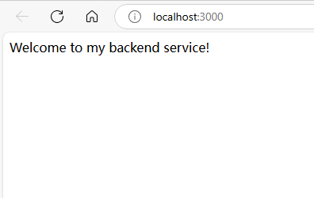
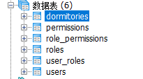
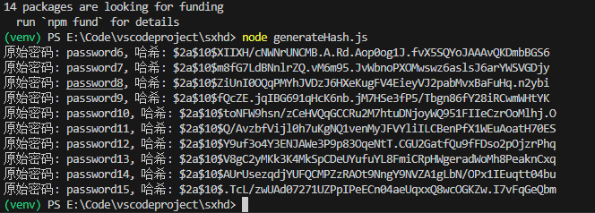

创建虚拟环境并启动

python -m venv venv
venv\Scripts\activate

下载依赖包

npm install express body-parser pg jsonwebtoken bcryptjs

启动    
node server.js

**********************************************************
基础URL
http://localhost:7197
接口列表
登录接口
方法：POST
路径：/admin/acl/index/login
请求体：{ "username": "string", "password": "string" }
响应：
成功：{ "code": 200, "data": { "token": "string" } }
失败：{ "code": 401, "message": "Invalid username or password" }
获取用户信息
方法：GET
路径：/admin/acl/index/info
请求头：Authorization: Bearer <token>
响应：
成功：{ "code": 200, "data": { "username": "string" } }
失败：{ "code": 403, "message": "Invalid token" }
获取全部的职位接口
方法：GET
路径：/admin/acl/role/
查询参数：page, limit, roleName
响应：{ "code": 200, "data": ["object"], "total": "number" }
新增岗位的接口
方法：POST
路径：/admin/acl/role/save
请求体：{ "name": "string", "description": "string" }
响应：{ "code": 200, "message": "Role created successfully", "data": "object" }
更新已有的职位
方法：PUT
路径：/admin/acl/role/update
请求体：{ "id": "number", "name": "string", "description": "string" }
响应：{ "code": 200, "message": "Role updated successfully", "data": "object" }
删除已有的职位
方法：DELETE
路径：/admin/acl/role/remove/:roleId
响应：{ "code": 200, "message": "Role removed successfully" }
权限管理接口
方法：GET
路径：/admin/acl/permission/toAssign/
查询参数：roleId
响应：{ "code": 200, "data": ["object"] }
给相应的职位分配权限
方法：POST
路径：/admin/acl/permission/doAssign/
请求体：{ "roleId": "number", "permissionId": "number" }
响应：{ "code": 200, "message": "Permission assigned successfully" }
获取宿舍信息
方法：GET
路径：/admin/acl/dormitory/
查询参数：page, limit
响应：{ "code": 200, "data": ["object"] }
获取全部已有用户账号信息
方法：GET
路径：/admin/acl/user/
查询参数：page, limit, username
响应：{ "code": 200, "data": ["object"], "total": "number" }
添加一个新的用户账号
方法：POST
路径：/admin/acl/user/save
请求体：{ "username": "string", "password": "string" }
响应：{ "code": 200, "message": "User created successfully", "data": "object" }
更新已有的用户账号
方法：PUT
路径：/admin/acl/user/update
请求体：{ "id": "number", "username": "string", "password": "string" }
响应：{ "code": 200, "message": "User updated successfully", "data": "object" }
获取用户坐标信息
方法：GET
路径：/api/user/coordinates
响应：[ { "id": "number", "username": "string", "email": "string", "longitude": "number", "latitude": "number" } ]
获取全部职位,当前账号拥有的职位接口
方法：GET
路径：/admin/acl/user/toAssign/
查询参数：userId
响应：{ "code": 200, "data": ["object"] }
给已有的用户分配角色接口
方法：POST
路径：/admin/acl/user/doAssignRole
请求体：{ "userId": "number", "roleId": "number" }
响应：{ "code": 200, "message": "Role assigned successfully" }
删除某个账号
方法：DELETE
路径：/admin/acl/user/remove/:userId
响应：{ "code": 200, "message": "User removed successfully" }
批量删除的接口
方法：DELETE
路径：/admin/acl/user/batchRemove
请求体：{ "idList": ["number"] }
响应：{ "code": 200, "message": "Users removed successfully" }
认证机制
获取令牌：通过/admin/acl/index/login接口，使用用户名和密码获取JWT令牌。
使用令牌：在需要认证的请求头中添加Authorization: Bearer <token>。
数据表：
CREATE TABLE public.dormitories
(
  id integer NOT NULL DEFAULT nextval('dormitories_id_seq'::regclass),
  name character varying(255) NOT NULL,
  capacity integer,
  description text,
  created_at timestamp without time zone DEFAULT now(),
  CONSTRAINT dormitories_pkey PRIMARY KEY (id)
)
CREATE TABLE public.permissions
(
  id integer NOT NULL DEFAULT nextval('permissions_id_seq'::regclass),
  name character varying(255) NOT NULL,
  description text,
  created_at timestamp without time zone DEFAULT now(),
  CONSTRAINT permissions_pkey PRIMARY KEY (id)
)
CREATE TABLE public.role_permissions
(
  role_id integer NOT NULL,
  permission_id integer NOT NULL,
  CONSTRAINT role_permissions_pkey PRIMARY KEY (role_id, permission_id),
  CONSTRAINT role_permissions_permission_id_fkey FOREIGN KEY (permission_id)
      REFERENCES public.permissions (id) MATCH SIMPLE
      ON UPDATE NO ACTION ON DELETE CASCADE,
  CONSTRAINT role_permissions_role_id_fkey FOREIGN KEY (role_id)
      REFERENCES public.roles (id) MATCH SIMPLE
      ON UPDATE NO ACTION ON DELETE CASCADE
)

CREATE TABLE public.roles
(
  id integer NOT NULL DEFAULT nextval('roles_id_seq'::regclass),
  name character varying(255) NOT NULL,
  description text,
  created_at timestamp without time zone DEFAULT now(),
  CONSTRAINT roles_pkey PRIMARY KEY (id)
)
CREATE TABLE public.user_roles
(
  user_id integer NOT NULL,
  role_id integer NOT NULL,
  CONSTRAINT user_roles_pkey PRIMARY KEY (user_id, role_id),
  CONSTRAINT user_roles_role_id_fkey FOREIGN KEY (role_id)
      REFERENCES public.roles (id) MATCH SIMPLE
      ON UPDATE NO ACTION ON DELETE CASCADE,
  CONSTRAINT user_roles_user_id_fkey FOREIGN KEY (user_id)
      REFERENCES public.users (id) MATCH SIMPLE
      ON UPDATE NO ACTION ON DELETE CASCADE
)
CREATE TABLE public.users
(
  id integer NOT NULL DEFAULT nextval('users_id_seq'::regclass),
  username character varying(255) NOT NULL,
  password character varying(255) NOT NULL,
  email character varying(255),
  created_at timestamp without time zone DEFAULT now(),
  longitude numeric(9,6),
  latitude numeric(9,6),
  CONSTRAINT users_pkey PRIMARY KEY (id)
)

**********************************************************
改进内容
参数解析: 增加了对 page 和 limit 的默认处理，以确保在没有参数时不会导致错误。
角色与用户管理: 显式处理角色和用户的信息，包括创建、更新和删除功能。
错误处理: 增强了错误处理，确保服务器在处理异常时返回正确的状态码和消息。
** bcrypt**: 通过 async/await 处理密码哈希，确保异步代码的可读性和结构。

**********************************************************
访问正确的API端点
如果你的前端代码只需要验证或使用 API 接口，则需要直接调用具体的接口，而不是访问根路径。例如，登录接口是 /admin/acl/index/login。可以用 Postman 或 curl 测试这个接口：

curl -X POST http://localhost:3000/admin/acl/index/login \
-H "Content-Type: application/json" \
-d '{"username": "your_username", "password": "your_password"}'
**********************************************************
测试结果：

数据表结构：

**********************************************************
1. CORS(Cross-Origin Resource Sharing)
由于你的前端文件可能是通过不同的端口（例如 http://127.0.0.1:5500）来加载的，而后端服务是运行在 http://localhost:7197，这可能会导致 CORS 问题。默认情况下，浏览器会阻止跨域请求。

解决方法：
在你的 Express 服务器中，启用 CORS。你可以使用 cors 中间件来解决这个问题。在你的后端代码中，进行以下修改：

npm install cors
然后在你的后端代码中，添加以下内容：

const cors = require('cors');

// 添加 CORS 中间件
app.use(cors());
**********************************************************
实现了用户前端定位显示，并进行人员坐标展示和人员信息展示，并通过点击人员信息列表能够在地图上进行定位，然后实现每一分钟刷新一次数据库中的人员坐标信息。
@
关于如何生成密码哈希和如何在 SQL 中使用的步骤。

1. 什么是 bcrypt 加密？
bcrypt 是一种加密方法，用于安全存储用户密码。在数据库中，您应该存储加密后的密码，而不是明文密码。这意味着即使有人访问了数据库，他们也无法直接看到用户的密码。

2. 如何生成 bcrypt 哈希值？
您可以使用 Node.js 中的 bcryptjs 库来生成 bcrypt 哈希值。以下是一个具体的步骤说明：

步骤 1：安装 bcryptjs
如果您还没有安装 bcryptjs，您可以使用 npm (Node Package Manager) 进行安装。先打开终端，进入到您的项目目录，然后执行以下命令：

npm install bcryptjs
步骤 2：使用 bcryptjs 生成哈希值
创建一个 JavaScript 文件，例如 generateHash.js，然后在文件中编写如下代码：

const bcrypt = require('bcryptjs');

// 设置您要加密的密码
const passwords = [
    'password6',
    'password7',
    'password8',
    'password9',
    'password10',
    'password11',
    'password12',
    'password13',
    'password14',
    'password15',
];

// 生成哈希并打印
passwords.forEach(async password => {
    const hashedPassword = await bcrypt.hash(password, 10);
    console.log(`原始密码: ${password}, 哈希: ${hashedPassword}`);
});
步骤 3：运行脚本
在终端中运行这个脚本：

node generateHash.js
这将输出带有明文密码和对应的哈希值。例如：

原始密码: password6, 哈希: $2a$10$E9W5a1di1EIfhtZHthrM2.e47CtgFl.HhhM5yHe3s14JmF9pFqzB0y
原始密码: password7, 哈希: $2a$10$AoOjFrk5TdBebx8z.Ii9ZuHc4kXIFG/5PObZ6N/cg0O2QmifdGSLy
...
步骤 4：将哈希值替换到 SQL 中
将生成的哈希值替换在 SQL 语句中。比如，您可以按照如下格式将它们插入数据库：

INSERT INTO users (username, password, email, longitude, latitude) VALUES 
('student6', '$2a$10$E9W5a1di1EIfhtZHthrM2e47CtgFl.HhhM5yHe3s14JmF9pFqzB0y', 'student6@example.com', 116.404, 39.915),
('student7', '$2a$10$AoOjFrk5TdBebx8z.Ii9ZuHc4kXIFG/5PObZ6N/cg0O2QmifdGSLy', 'student7@example.com', 116.500, 39.900),
('student8', '$2a$10$4zjFfokRn8syneJlTOs2qeXz78Wx.Jo4FgCv3mUfn2hF9Z2zsG2Gq', 'student8@example.com', 116.300, 39.800),
('student9', '$2a$10$ReSUve6K3aN1w1qZPuRLguzobHAkJ9fEsKnbMaGCWnPnQITiio.iW', 'student9@example.com', 116.600, 39.850),
('student10', '$2a$10$ChSG9K0p/tP3xIX7tMdO7O04n6TdxjlftWOhBrgGkUmBxaD8Ly3Fu', 'student10@example.com', 116.100, 39.750),
('student11', '$2a$10$examplehashedpassword6', 'student11@example.com', 116.200, 39.700),
('student12', '$2a$10$examplehashedpassword7', 'student12@example.com', 116.400, 39.600),
('student13', '$2a$10$examplehashedpassword8', 'student13@example.com', 116.500, 39.500),
('student14', '$2a$10$examplehashedpassword9', 'student14@example.com', 116.700, 39.400),
('student15', '$2a$10$examplehashedpassword10', 'student15@example.com', 116.800, 39.300);

